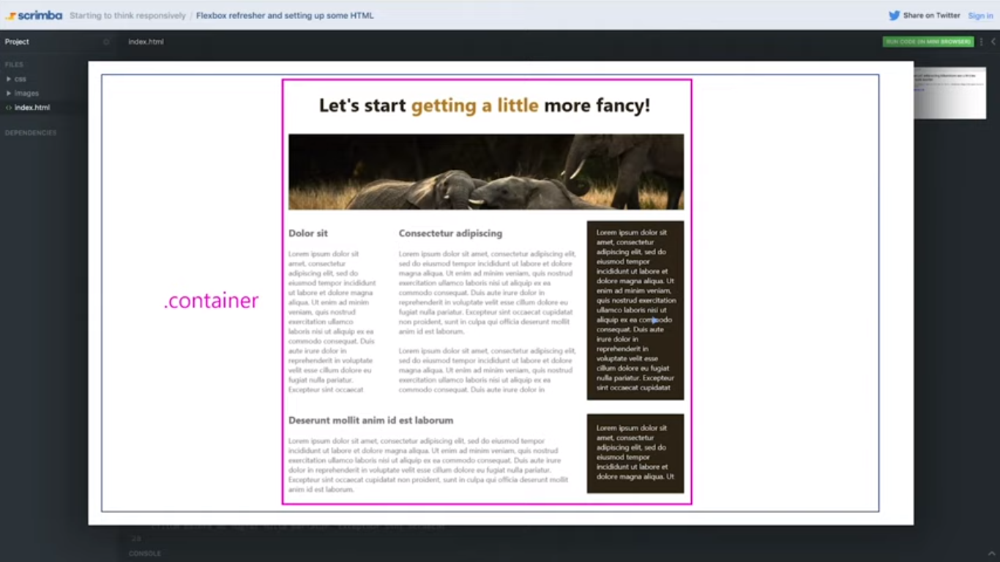
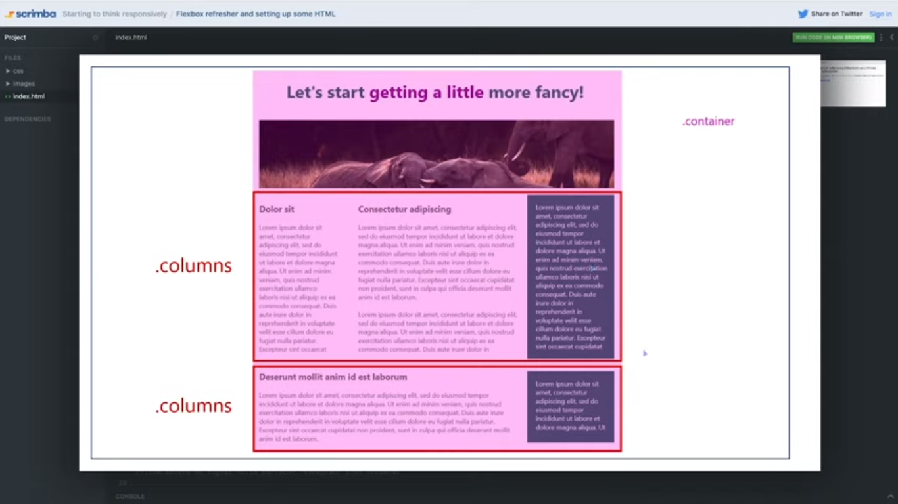
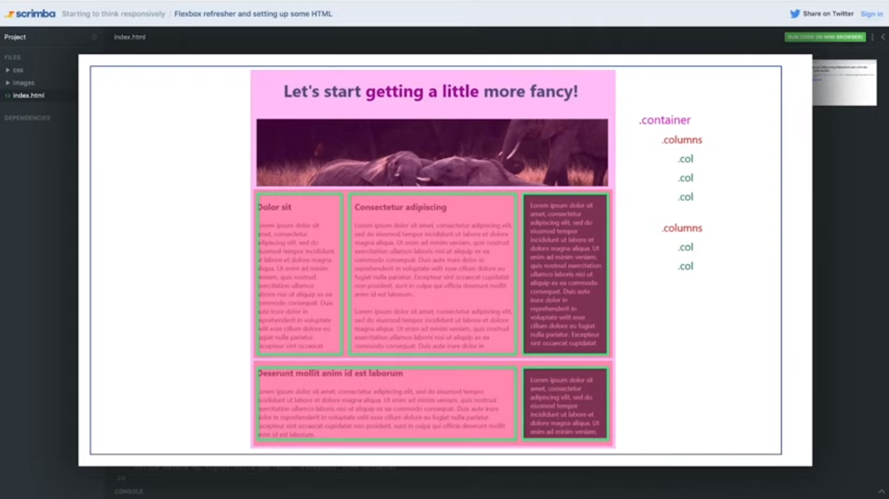

# Flexbox

One entire container is going to hold all the content of the page.

Wee need two rows for work with the content, that is why we are going to use the flex property. In Flexbox the main axis is horizontal by default, so the items flow into a row.

Each row going to hold different numbers of columns. Each one need to have his own columns because tags with the block property going to mess around with the design.

