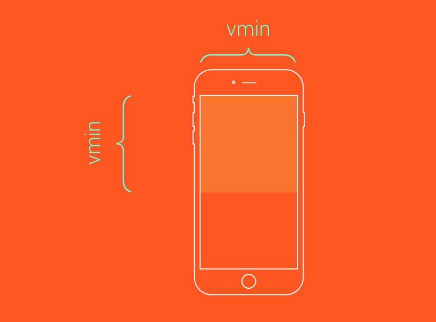
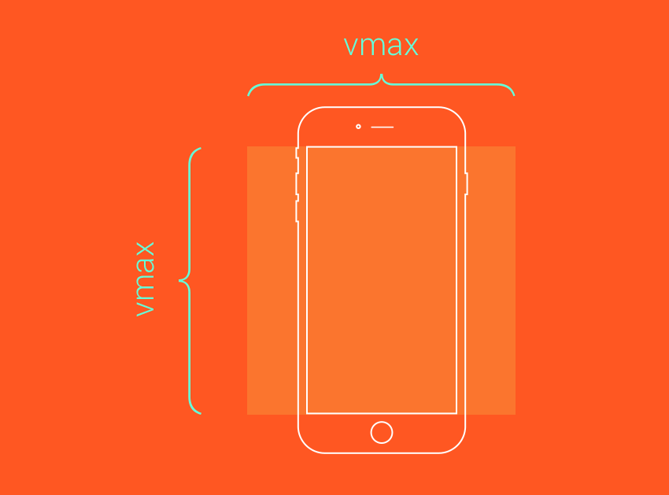

# Units

## Absolut units

Is fixed across all devices and may vary in each screen. They depend on the DPI (dots per inch). Work very well when the document or page need to be print.

- px - Pixel: is good when setting a border since we want it to stay the same on different screen sizes, unlike font sizes.

- pt - Point
- pc - Picas
- in - Inch
- cm - Centimeter
- mm - Millimeter

## Relatives units

they are relative to something it could be the font size of a parent element, the size of a viewport, etc.

### Relative to font sizes

- em - It is relative to the immediate parent element if is used in the font-size property but in any other property is relative to his own font-size. Work very well with margins and padding. Have a weird effect in font size because multiply the immediate parent element creating a cascade effect, Don't use it for font size.
- rem(Root em) - Relative to font-size of the root element, the root element of an html is always the <html> tag, 1rem is equal to 16px (default root element font size) and is commonly used for font sizes.
- ex - Relative to the x-height of the current font OR one-half of one em”. Thex-height of a given font is the height of the lower-case x of that font. Often times, this is about at the middle mark of the font. The sup element, which stands for superscript, can be pushed up in the line using position relative and a bottom value of 1ex.
  

- ch(Character unit) - Relative to the width of zero character. the basic concept is that, given a monospace font, a box with a width of **N** character units, such as width: 40ch;, can always contain a string with 40 characters in that particular font.

### Relative to viewport

- % - Relative to the parent element, Is commonly used as the widht and height of an element. Is also ussefull when creating a responsive layout.
- vw - The viewport width is relative to 1% of the width viewport (browser window), The difference between percentage (%) and vw is that the first unit is relative to the containing element while vw is relative to the viewport which in this case is the browser window.
- vh - The viewport height is relative to 1% of the height viewport (browser window), 5vh will lead to 5% of the current viewport height. This unit works just like the vw but with the height of a viewport, it is helpful when building a responsive website
- vmin - The viewport minimum is relative to 1% of the viewport (browser window). Imagine you need an element that is always visible on screen. Using a height and width set to a vmin value would enable this. For example, a square element that always touches at least two sides of the screen might be defined like this:
  ```css
  .box {
    height: 100vmin;
    width: 100vmin;
  }
  ```
  
- vmax - The viewport maximum is relative to 1% of the viewport (browser window). If you needed a square box that always covers the visible viewport (touching all four sides of the screen at all times):
  ```css
  .box {
    height: 100vmax;
    width: 100vmax;
  }
  ```
  
  - > If the browser was set to 1100px wide and the 700px tall, **1vmin** would be 7px and **1vmax** would be 11px. However, if the width was set to 800px and the height set to 1080px, **1vmin** would be equal to 8px while **1vmax** would be set to 10.8px.

## Rule of thumbs (subject to changes)

- Font-size: rem.
- Padding & margins: em.
- Widht: % or em, pixels in some cases.

> **Always use the same unit.**
